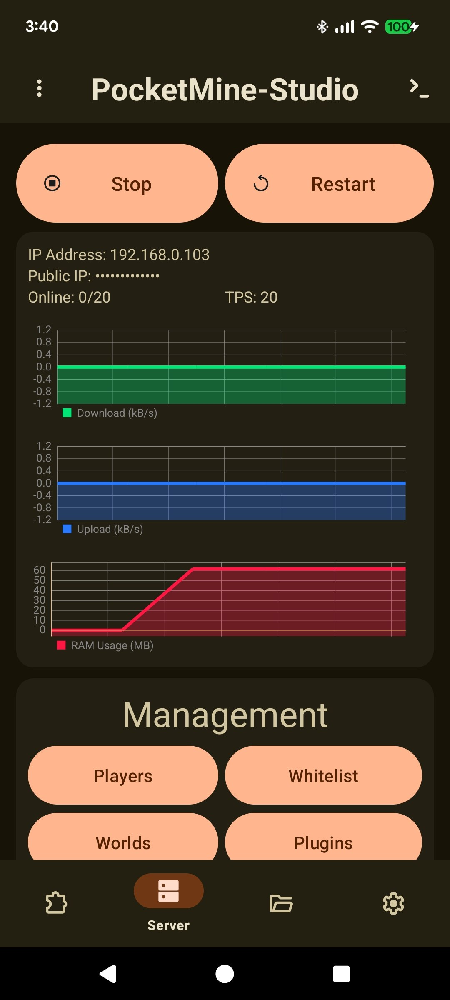
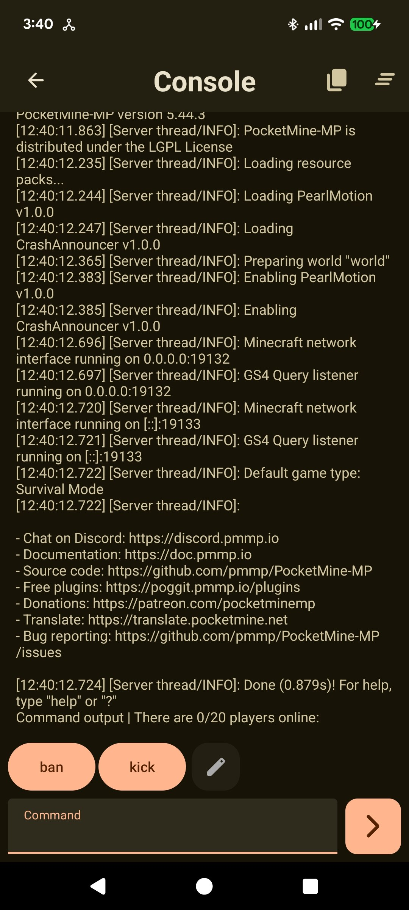
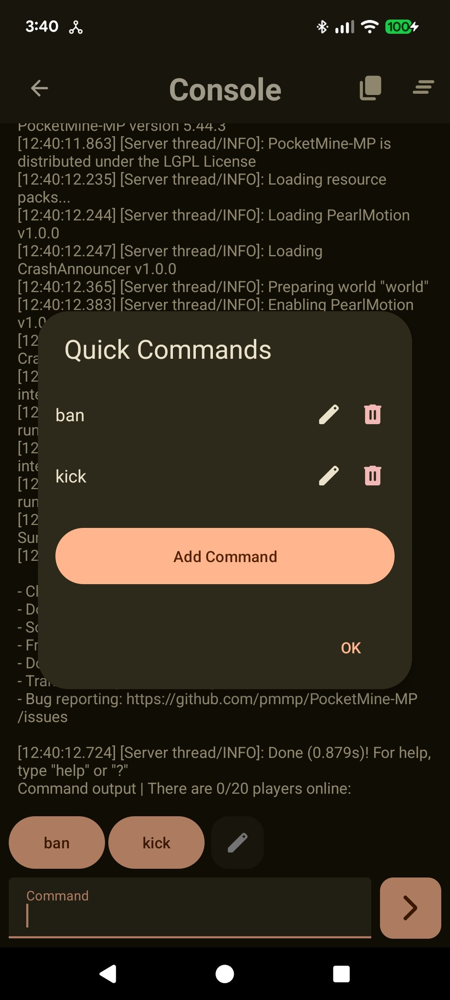
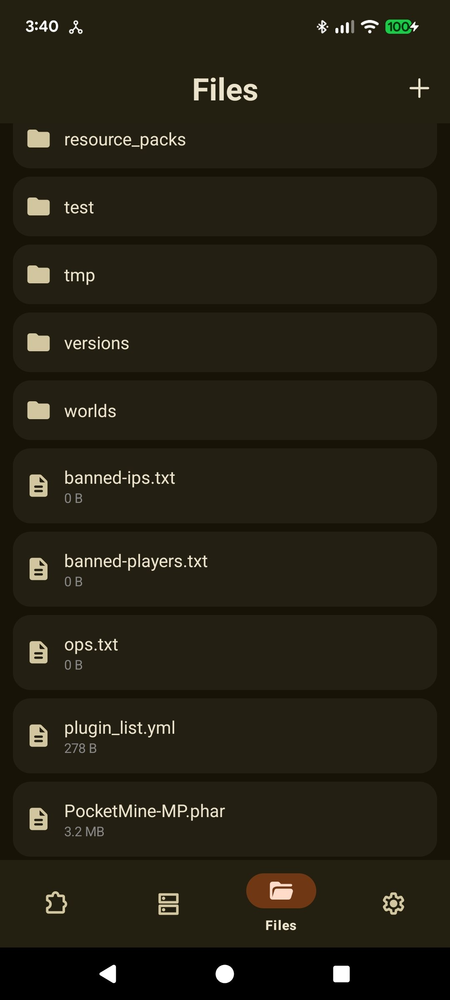
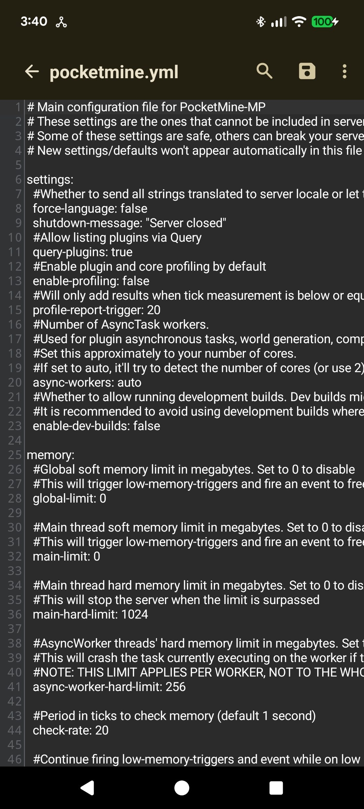
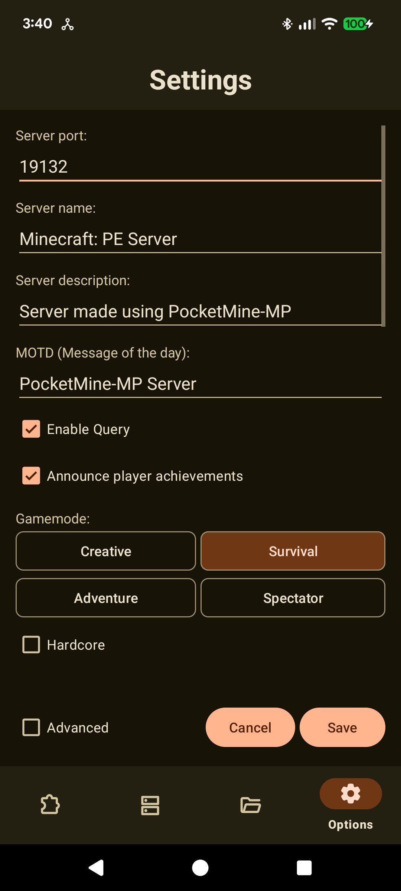
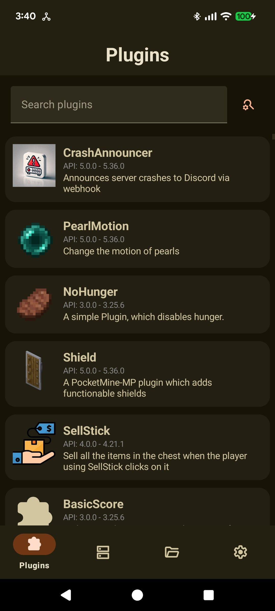
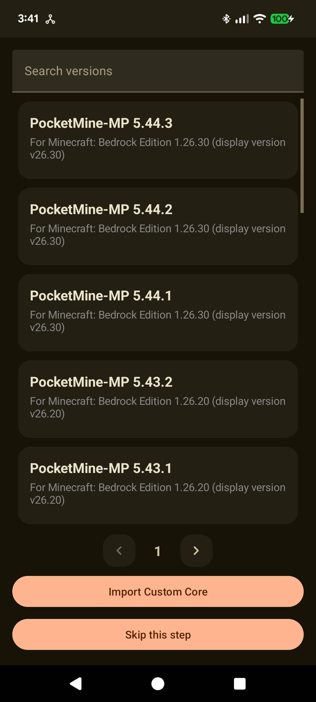

# PocketMine-Studio

  

  

Run your own PocketMine-MP server directly on your Android device.

A fork of the [original PocketMine-Android repository](https://github.com/PocketMine/PocketMine-Android) that fixes legacy issues and introduces new features.

## Features

- Supports Android 7.0–17
- Support for the latest versions of PocketMine-MP
- Integration with Poggit
- Version Manager
- Event Scheduler
- File Manager
- Many other new features

## Screenshots

